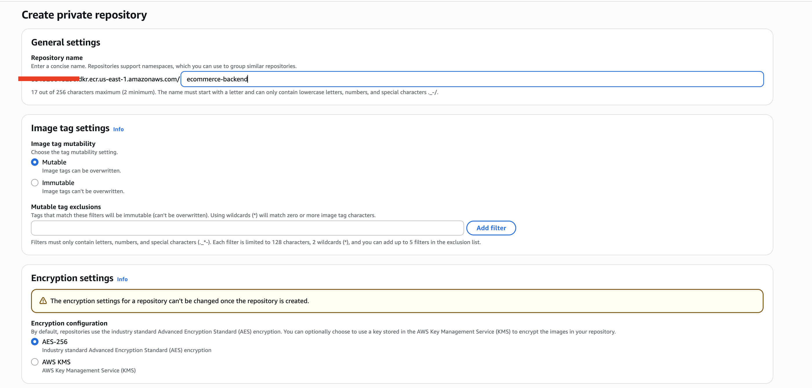

## References

[Implementing GitOps and with Kubernetes](...)
[How to Set Up ArgoCD for Production](https://www.youtube.com/watch?v=_G_RY5trQao&t=1012s)

### Introduction

This project focuses on strategies to build scalable cluster infrastructures using GitOps. This includes designing Kubernetes clusters that can adapt to increasing demands, all managed through GitOps methodologies. 

### Continuous Deployment

Continuous deployment goes a step further by automatically deploying every change that passes testing directly into production, eliminating manual steps. This accelerates the release process but demands high confidence in automation and testing protocols.

CD not only reduces the risks associated with deploying releases by enabling smaller and more frequent updates that are easier to manage than larger, infrequent ones, but it also significantly shortens prolonged testing cycles typically necessary for extensive code changes. 

In GitOps, Git is not just a version control system; it’s the single source of truth for both application code and infrastructure configuration. This approach leverages the strengths of Git – such as version control, collaboration features, and the pull request workflow – to manage the entire deployment and operational process. 

### Kubernetes and Argo CD

The fusion of GitOps with Kubernetes significantly quickens and improves the efficiency of deployment processes

Argo CD, a GitOps CD for Kubernetes (argo-cd.readthedocs.io), is a declarative tool for continuous delivery specifically designed for Kubernetes. 
It functions as a standalone solution or can be integrated into your existing CI/CD pipeline to efficiently deploy necessary resources across your Kubernetes clusters.

Integrating GitOps and Kubernetes using Argo CD provides a streamlined approach for managing cloud-native applications and jobs on Kubernetes. Argo CD, part of the Argo project family, offers a suite of tools, including **Workflows**, **Events**, and **Rollouts**, that enhance Kubernetes-native application delivery.

Argo CD is versatile as it supports raw `YAML manifests`, `custom configuration management`, and popular tools such as `Kustomize`, `Helm`, and `Jsonnet`.

**If you want to create an effective GitOps strategy in Kubernetes with Argo CD**:

- **User onboarding**: Simplifying the onboarding process is crucial. Centralizing the installation, setup, and maintenance of deployment operators can ease the process of transitioning multiple microservices to Kubernetes, rather than placing this burden on individual teams. Incorporating single sign-on (SSO) is particularly beneficial in systems with a large user base, streamlining the introduction of new users.

- **Multi-tenancy and management**: In environments with multiple tenants, users need secure and flexible access to resources. Kubernetes’ role-based access control (RBAC) system is a powerful feature but might not suffice for managing numerous clusters. Argo CD enhances this with additional access control features, integrating seamlessly with SSO providers and facilitating access to multiple clusters.

- **Observability**: A key feature of an effective CD tool is enabling developers to monitor and track the state of their applications. Argo CD’s user-friendly interface provides detailed insights into an application’s configuration, such as sync status with Git, specific out-of-sync elements, and any operational issues.

### Helm Charts with GitOps

Helm generates artifacts that can not only be deployed but also shared and capable of version control, establishing itself as a comprehensive package manager for Kubernetes environments.

Helm tackles the challenges associated with the mutable nature of application settings, particularly within Kubernetes ConfigMaps. It recognizes that mere alterations to ConfigMaps may not trigger automatic updates to applications.

To combat this, Helm introduces methods to activate rolling updates following changes in ConfigMaps, thus ensuring continuous application performance and enhanced management efficiency. 

We can effortlessly integrate Helm charts with Git and GitOps practices to establish a single source of truth for our application’s desired state. This integration is fundamental for modern DevOps workflows as it leverages the versioning capabilities of Git alongside the automated, declarative nature of GitOps.

### File Structure

The `.github/workflows` directory will house the definitions of the CI/ CD pipeline used by GitHub Actions. This pipeline is responsible for building and pushing a new Docker image to a container registry each time changes are committed to the GitHub repository, thereby automating the deployment process and ensuring that updates are seamlessly reflected in the live application.

### Git Branches

Best practices suggest using a different `feature` branch for each feature that we want to implement. 

Create a feature branch using the command:

```sh
git checkout -b features/docker-file-and-ci
```

Merge the `features/dockerfile-and-ci` branch into the main branch to add your updates.

### Create Helm Charts

```sh
helm create ecommerce-golang-backend
```

Change image in values.yaml to `aleroawani/ecommerce-backend:latest`

Install helm chart on cluster manually

```sh
helm install golang-backend ./ecommerce-golang-backend
```
>
>**Note**: `appVersion` tells what version of the actual app (not the chart) is being deployed. And so changing the image tag will mean having to update the appVersion too. This change is done in the chart.yaml.
>


## ARGOCD IMAGE UPDATER

### STEP 1: Terraform

The Terraform code located in the `terraform` directory provisions an EKS cluster and installs Argo CD using the Helm provider.

```sh
terraform init
```

```sh
terraform fmt
```

```sh
terraform plan
```

```sh
terraform apply
```

### STEP 2: CREATE ECR REPOSITORY

